## Medical Discussion/Stydies Posts App

A simple React-based web application that allows users wether they are a doctor or patient to create, view, and search posts.
This project includes user login functionality, searching through posts,
designed to be extended with styling, and responsiveness.

------------------------------------------------------------------------
## Features
-User Profiles: View user details and customizable bios

-Post Management: Create, view, and search posts

-Interactive Elements: Like and comment on posts

-Role-based Access: Different permissions for doctors and patients


------------------------------------------------------------------------

# Technologies Used

-   React.js
-   React Router
-   React Hooks (useState)
-   JavaScript
-   CSS

------------------------------------------------------------------------

## Setup Instructions

Follow these steps to run the project locally:

### 1 Clone the repository

``` bash
git clone https://github.com/saad-alSouheil/CSCI426-Project01.git
```

### 2 Install dependencies

``` bash
npm install
```

### 3 Start the development server

``` bash
npm start
```

The app will open automatically at:\
👉 http://localhost:3000

------------------------------------------------------------------------

## Screenshots


### 🏠 Home Page

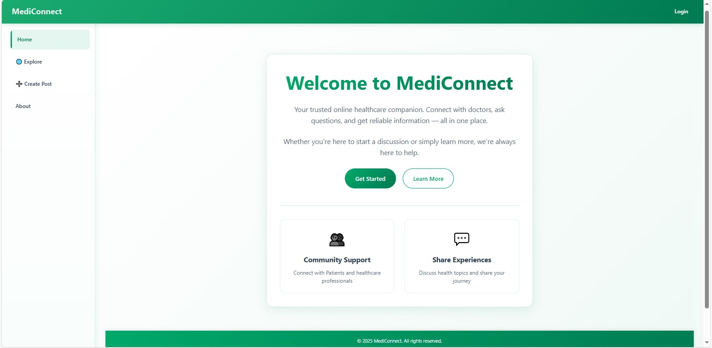

### 📝 Login

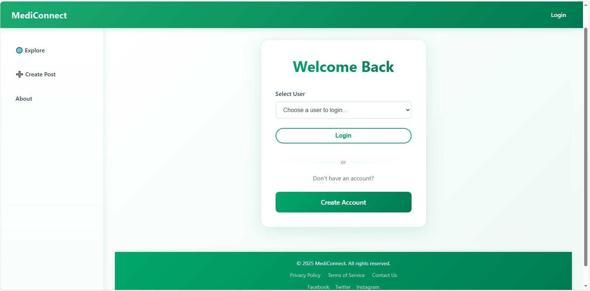

### 📝 SignUp

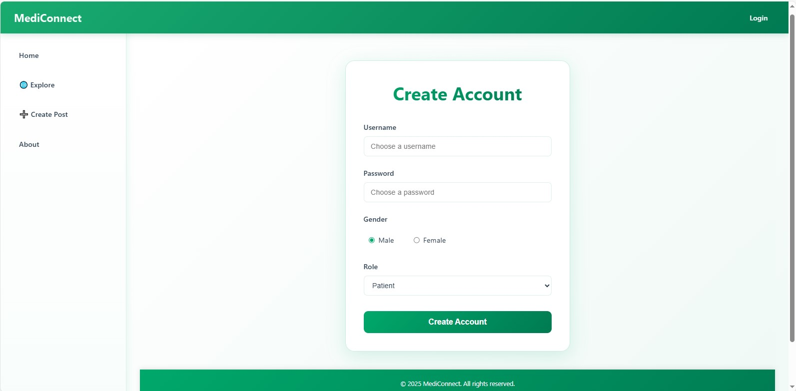

### 📝 About

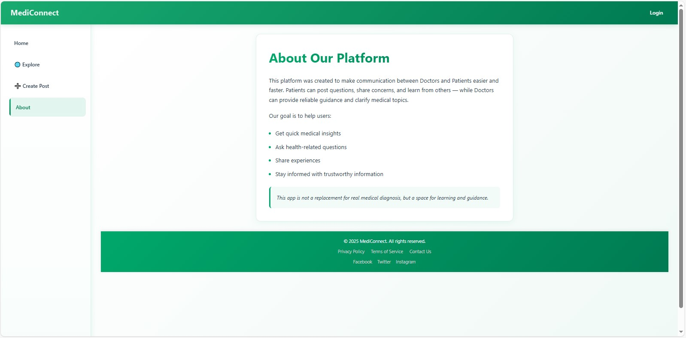

### 📝 Dr. Dashboard

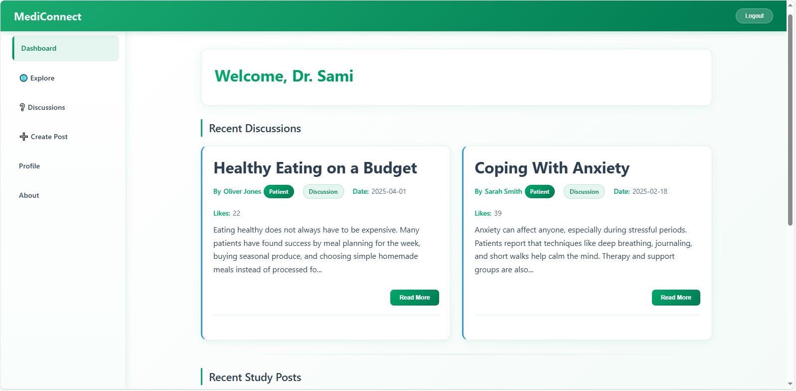

### 📝 Patient Dashboard

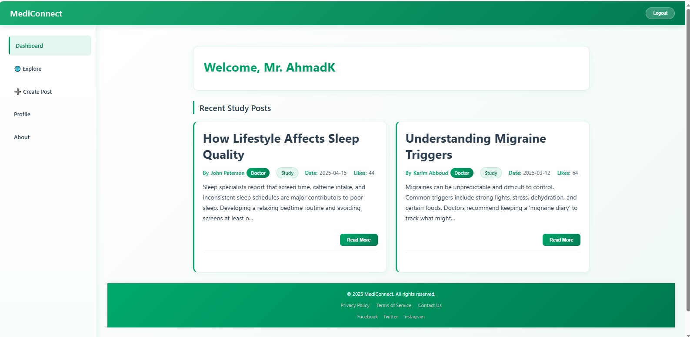

### 📝 Explore Page

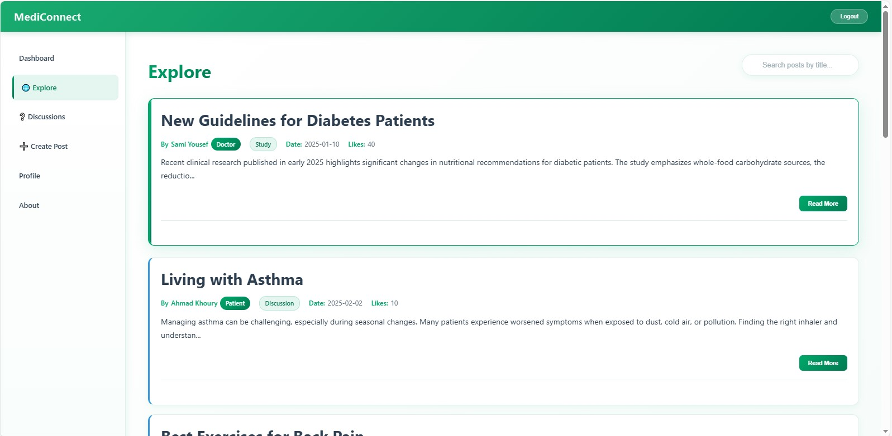

### 📝 Discussions Page

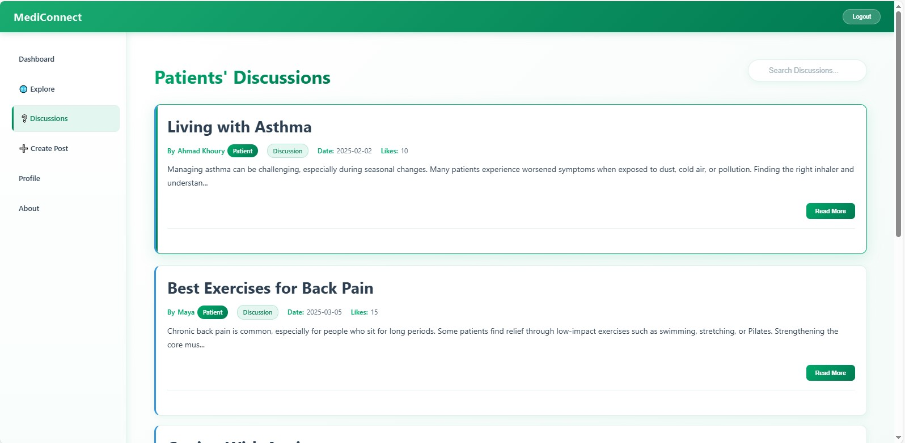

### 📝 Profile

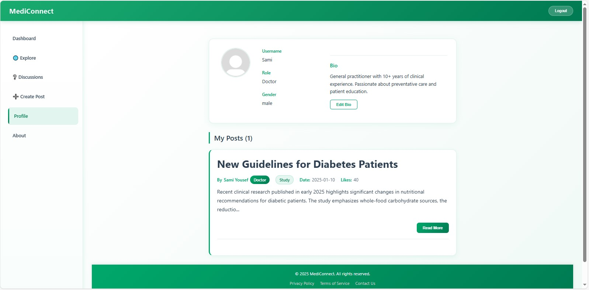

### 📝 Create Post

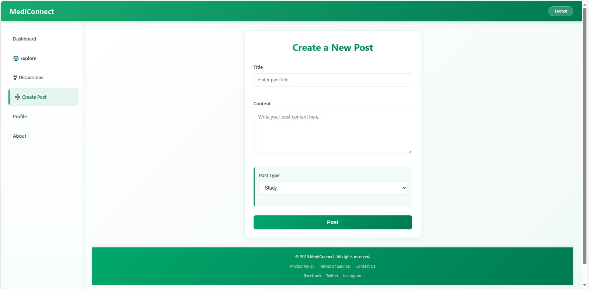

### 📝 Read Post

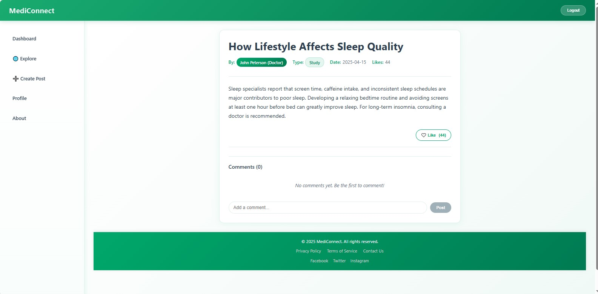
------------------------------------------------------------------------

## 📄 License

This project is free to use for learning and personal development.
